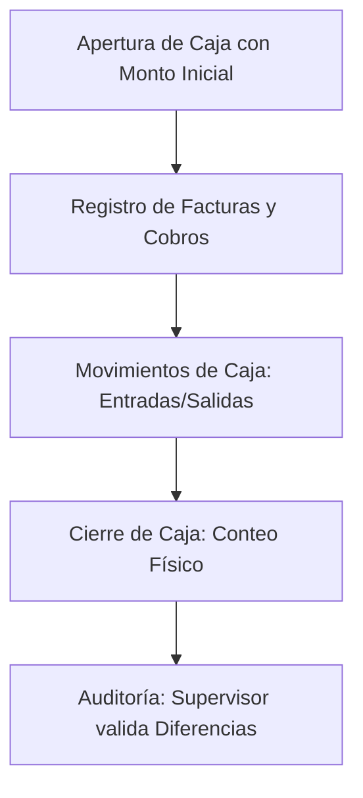

# Manual de Usuario - S_Hospital (Sistema de Facturación Local LAN)

Este manual contiene las instrucciones oficiales para el uso, administración y mantenimiento técnico de **S_Hospital OS**, un sistema local diseñado para operar de forma 100% autónoma y offline en redes locales (LAN).

---

## 1. Introducción y Accesos Rápidos (Shortcuts)

El sistema S_Hospital está diseñado para agilizar el proceso de cobro en cajas hospitalarias. La interfaz de Punto de Venta (POS) permite operar casi en su totalidad utilizando únicamente el teclado.

### Combinaciones de Teclas (Shortcuts en POS)

| Atajo | Acción en el Sistema |
| :--- | :--- |
| **`F2`** | Abrir modal de cobro / Registrar pago. |
| **`F4`** | Buscar paciente / Cambiar nombre del paciente. |
| **`F8`** | Limpiar venta actual (vaciar carrito). |
| **`Esc`** | Cerrar cualquier ventana modal activa. |
| **`Enter`** | Confirmar selección en campos de búsqueda o formularios. |

### Flujo de Acceso Local LAN
1. Encienda la computadora Servidor.
2. Inicie el servidor web ejecutando el comando de inicio en la computadora principal.
3. Desde las computadoras cliente conectadas al mismo switch/router local, abra Google Chrome e ingrese la URL de red local:
   * **Ejemplo:** `http://192.168.1.15:8000`
4. Inicie sesión con su usuario y contraseña asignados.

---

## 2. Protocolos de Anulación de Facturas

En S_Hospital, **las facturas nunca se eliminan físicamente de la base de datos**. Esto asegura el cumplimiento de las auditorías fiscales y evita fraudes en caja.

### Reglas Críticas de Anulación
* **Permiso Requerido:** Solo los usuarios con rol de **Supervisor** o **Administrador** (permiso `invoices.void`) pueden anular facturas.
* **Motivo Obligatorio:** Al anular una factura, el sistema exige ingresar un motivo claro y justificado (mínimo 10 caracteres).
* **Auditoría Permanente:** Cada anulación queda registrada en el registro de auditoría (`audit_logs`) detallando el ID de la factura, el usuario que la anuló, la fecha exacta y el motivo.
* **Impacto en Caja:** El subtotal e impuesto de una factura anulada se restan de los totales de venta, y los pagos asociados se marcan como anulados de manera que no inflen los totales cobrados.

### Procedimiento para Anular una Factura
1. Vaya al menú de **Facturas** en el panel de navegación.
2. Localice la factura a anular por su número fiscal o nombre del paciente.
3. Haga clic en **Ver Detalle**.
4. Presione el botón **Anular Factura** (solo visible si tiene rol de supervisor/admin).
5. Ingrese el motivo de la anulación (ej. *"Captura incorrecta de servicio de laboratorio"*).
6. Presione **Confirmar Anulación**. El estado de la factura cambiará a `void` (Anulada).

---

## 3. Apertura, Auditoría y Cierres de Caja

El control diario de caja se gestiona a través de sesiones individuales para cada cajero.

### Flujo Operativo Diario



### 1. Apertura de Caja
Antes de emitir cualquier factura, el cajero debe abrir su sesión ingresando el efectivo inicial en caja (fondo de caja para cambio).
* **Ejemplo:** `L. 500.00`

### 2. Auditoría en Tiempo Real
El administrador o supervisor puede auditar el estado de cualquier caja activa desde el panel de reportes de caja:
* **Efectivo Esperado:** `Monto Inicial + Pagos en Efectivo + Entradas de Caja - Salidas de Caja`.
* **Diferencia de Caja:** Al momento de cerrar, el cajero cuenta el dinero real físicamente y el sistema calcula automáticamente cualquier faltante o sobrante.

### 3. Cierre de Caja
Al terminar el turno:
1. El cajero ingresa al panel de su sesión y presiona **Cerrar Caja**.
2. Cuenta físicamente el efectivo en caja e ingresa el valor en el campo **Monto de Cierre**.
3. Escribe comentarios si existieron eventualidades y confirma el cierre.
4. El supervisor revisa el reporte consolidado donde se detalla:
   * Total por método (Efectivo, Tarjeta, Transferencia).
   * Diferencia calculada (ej. `L. +0.75` o `L. -5.00`).
   * Listado detallado de movimientos de efectivo.

---

## 4. Respaldos (Backups) y Recuperación ante Desastres

Al ser un sistema offline, **la seguridad de los datos depende enteramente del plan de respaldos local**.

### Creación de Copias de Seguridad (Backups)
El sistema genera archivos `.sql` autocontenidos que comprimen la base de datos completa.

#### A. Desde la Interfaz Web (Panel Admin)
1. Inicie sesión como Administrador.
2. Vaya a **Configuración** > **Backups**.
3. Presione el botón **Crear Copia de Seguridad**. El estado se registrará inicialmente como `pending` y cambiará a `success` en pocos segundos.
4. Presione **Descargar** para descargar el archivo de respaldo.
5. **CRÍTICO:** Copie el archivo descargado a una unidad de almacenamiento externa (USB) de forma diaria.

#### B. Programación Automática Diaria
El instalador configura una tarea diaria en el Windows Task Scheduler que corre:
* **Comando:** `php artisan hospital:backup --type=scheduled`
* **Hora:** Todos los días a las `23:00` (o la hora configurada).
* **Ubicación local:** Los respaldos se guardan en `backend/storage/app/private/backups`.

---

### Procedimiento de Restauración (Restore)

> [!CAUTION]
> **NUNCA ejecute una restauración directa en la base de datos de producción sin haberla probado previamente en una base de datos limpia de pruebas.**

#### Paso 1: Verificar Integridad del Backup
Antes de cualquier restauración, obtenga la suma de comprobación del archivo (checksum SHA256) para asegurar que no esté corrupto:
```powershell
Get-FileHash C:\backups\hospital-backup.sql -Algorithm SHA256
```

#### Paso 2: Probar la Restauración en Base Limpia de Pruebas
1. Inicie sesión en la consola del servidor MySQL y cree una base de datos vacía de pruebas:
   ```sql
   CREATE DATABASE hospital_restore_test CHARACTER SET utf8mb4 COLLATE utf8mb4_unicode_ci;
   ```
2. Restaure el archivo en esta base de pruebas:
   ```powershell
   mysql -u root -p hospital_restore_test < C:\backups\hospital-backup.sql
   ```
3. Modifique el archivo `.env` de pruebas para apuntar a `hospital_restore_test` y corra las pruebas de Laravel para validar que todo esté íntegro:
   ```powershell
   php artisan test
   ```

#### Paso 3: Restaurar en Producción
Una vez validada la base de pruebas:
1. Active el modo de mantenimiento en la aplicación para bloquear accesos:
   ```powershell
   php artisan down --secret="mantenimiento-clave"
   ```
2. Realice un backup de seguridad final de la base actual antes de tocar nada.
3. Ejecute el restore del backup seleccionado en la base activa (`hospital_billing`).
4. Limpie y regenere la caché del sistema:
   ```powershell
   php artisan config:cache
   php artisan route:cache
   ```
5. Desactive el modo de mantenimiento:
   ```powershell
   php artisan up
   ```

---

## 5. Activación de Licencia Offline

Para producción multi-usuario LAN, el sistema requiere registrar una licencia comercial offline.

### Estructura del Archivo `license.json`
El archivo de licencia debe ubicarse en la carpeta de almacenamiento de la aplicación:
`backend/storage/app/license.json`

Este archivo contiene la firma digital de validación que valida que los datos no hayan sido alterados localmente:

```json
{
  "licensee": "Clinica y Hospital de Prueba S.A.",
  "rtn": "08011999123456",
  "expires_at": "2027-12-31",
  "signature": "de78fb216cb34ea7205a28b0304859a1122a2bf89ee60731f8b1d8f58b7333a9"
}
```

### Reglas de Validación de Licencia
1. **Coincidencia de RTN:** El RTN del archivo de licencia debe coincidir exactamente con el RTN configurado en el sistema en **Configuración Fiscal**.
2. **Fecha de Expiración:** El servidor local compara la fecha del sistema con `expires_at`. Si ha expirado, el sistema restringe ciertas funcionalidades administrativas hasta renovar.
3. **Firma Digital (HMAC):** La firma digital se genera utilizando el algoritmo SHA256 con el siguiente formato de payload salado:
   `licensee|rtn|expires_at` firmado con la clave privada interna. Cualquier cambio manual al nombre del hospital o al RTN romperá la firma y marcará la licencia como **Firma Inválida**.

---

## 6. Soporte Técnico Local
* **Base de Datos Local:** MariaDB / MySQL en puerto `3306`.
* **Servidor Web LAN:** Apache / Nginx / PHP en puerto `8000`.
* **Logs Operativos:** Revise `backend/storage/logs/laravel.log` ante errores de backend.
