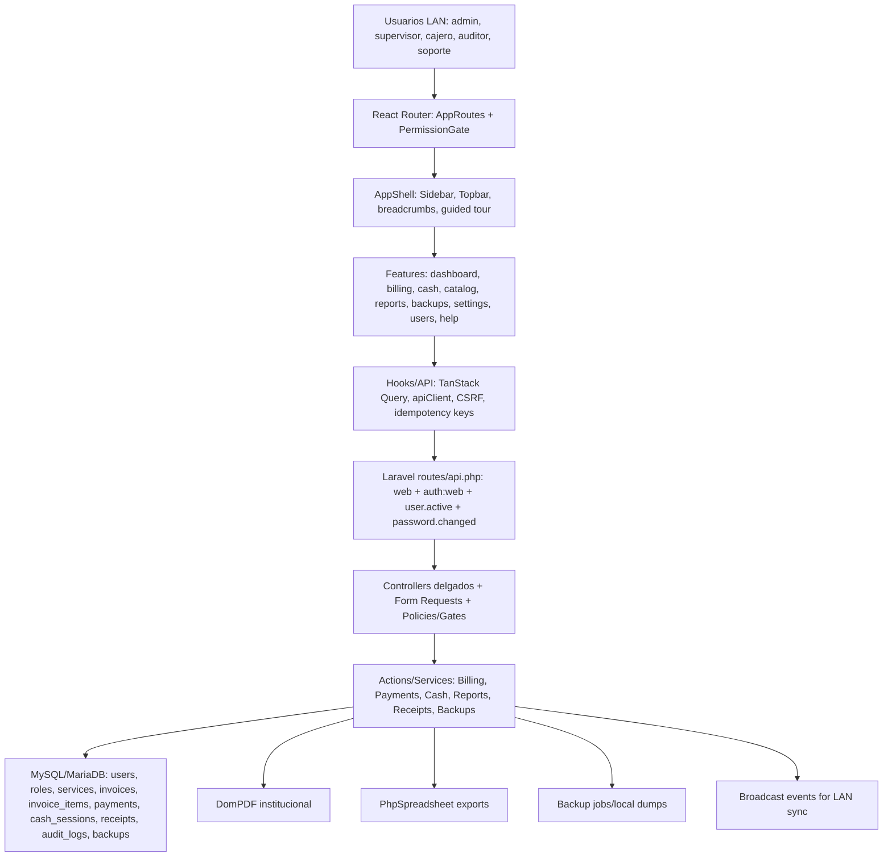

# S_Hospital Architecture and Visual Audit

Fecha de auditoria: 2026-06-20  
Fase: 0, descubrimiento, diagnostico y planificacion  
Modo: solo lectura salvo este informe  
Repositorio: `C:\Projects\S_Hospital`

## 1. Resumen ejecutivo

S_Hospital es un sistema offline LAN de caja y facturacion hospitalaria. La arquitectura real coincide en lo esencial con la identidad del proyecto: frontend React + TypeScript, backend Laravel, base de datos MySQL/MariaDB en produccion, autenticacion por sesion/cookies, permisos con Spatie Permission, facturacion transaccional, pagos asociados a caja y recibos institucionales PDF.

Hecho comprobado: el producto implementado no es un HIS clinico completo. El alcance real cubre dashboard, nueva factura, caja, pagos, catalogo de servicios, historial, recibos institucionales, reportes, respaldos, configuracion fiscal, configuracion de recibos, usuarios/roles, ayuda/soporte, auditoria y operacion offline LAN. `docs/MODULOS_IMPLEMENTADOS.md` declara explicitamente que citas, expediente clinico, hospitalizacion, laboratorio clinico y farmacia clinica quedan fuera de alcance.

El estado tecnico general es bueno para una refactorizacion visual incremental: `npm run typecheck`, `npm run lint`, `npm run test`, `npm run build` y pruebas unitarias backend focales pasaron. El riesgo principal no esta en falta de estructura, sino en tocar pantallas con logica operativa embebida, sobre todo `NewInvoiceView`, `InvoiceHistoryView`, `CashBoxView`, reportes y recibos. La migracion visual debe empezar por tokens y primitivas compartidas, no por reescribir pantallas de facturacion.

Diagnostico shadcn/ui: el proyecto ya tiene `components.json`, Tailwind v4, alias `@`, Radix UI, lucide y componentes locales estilo shadcn. La CLI de shadcn no esta disponible localmente, por lo que no se ejecuto `npx shadcn` para evitar instalacion implicita. La ruta viable es consolidar el sistema existente hacia patrones shadcn, no ejecutar una reinstalacion masiva.

Primer bloque recomendado: Fase 1 de fundamentos visuales compartidos: normalizar tokens, estado de foco, tipografia, `Card`, `Button`, `FormField/Field`, `Table`, `Dialog/AlertDialog`, `Sheet`, `Badge`, `Skeleton/Empty/Error`, `Toast` y convenciones de iconos. No debe tocar calculos, endpoints, migraciones ni flujos de caja/factura.

## 2. Alcance inspeccionado

Se inspecciono:

- Instrucciones: `AGENTS.md`, prompts `00_PLAN_MODE_MASTER_PROMPT.md` y `01_PLAN_REVIEW_ORCHESTRATOR.md`.
- Documentacion clave: `docs/ARCHITECTURE_CURRENT.md`, `docs/API_CONTRACTS.md`, `docs/MODULOS_IMPLEMENTADOS.md`, `docs/PERMISSIONS_MATRIX.md`, `docs/IMPLEMENTATION_PLAN.md`, `docs/DECISIONS.md`, `SYSTEM_REQUIREMENTS.md`.
- Frontend: `frontend/package.json`, `frontend/package-lock.json`, `frontend/components.json`, `frontend/vite.config.ts`, `frontend/tsconfig.json`, `frontend/eslint.config.js`, `frontend/src`.
- Backend: `backend/composer.json`, `backend/composer.lock`, `backend/routes`, `backend/app`, `backend/database/migrations`, `backend/database/seeders`, `backend/tests`.
- Infraestructura: `docker-compose.yml`, `docker-compose.prod.yml`, `backend/Dockerfile`, `backend/Dockerfile.prod`, `nginx`, scripts y docs operativas.
- Seguridad/privacidad: rutas, middlewares, policies, Form Requests, logs cliente/servidor, backups y descargas.

Excluido del recorrido detallado: `.git`, `node_modules`, `vendor`, `frontend/dist`, caches, artefactos de build, binarios y dependencias vendorizadas.

## 3. Archivos o areas no inspeccionadas

- No se abrieron valores de `.env`. Se leyo `backend/.env.example` y se mencionan solo nombres de variables.
- No se inspeccionaron en detalle los `.docx` de `docs/`; se priorizaron Markdown y codigo fuente.
- No se conecto a ninguna base de datos real ni de produccion.
- No se levanto la aplicacion en navegador porque la auditoria requeria no crear datos y no hay garantia de entorno local con datos de desarrollo aislados.
- No se ejecuto `shadcn info` porque no existe CLI local (`SHADCN_CLI_NOT_AVAILABLE_LOCALLY`).
- No se ejecuto PHPUnit completo porque gran parte de Feature tests usa `RefreshDatabase`, lo que implicaria migraciones aunque fueran de testing.

## 4. Estado de Git inicial

- Raiz real: `C:/Projects/S_Hospital`
- Rama: `main`
- `git status --short` inicial: sin salida.
- `git diff --stat` inicial: sin salida.
- Tipo: repositorio monorepo funcional con `frontend/`, `backend/`, `database/`, `docs/`, `scripts/`, `qa/`, `references/`, `prompts/`, `nginx/`, `offline-release/`.

## 5. Stack con versiones

| Area | Tecnologia | Version comprobada | Evidencia |
|---|---:|---:|---|
| Frontend | React | 19.2.6 locked | `frontend/package-lock.json` |
| Frontend | React DOM | 19.2.6 locked | `frontend/package-lock.json` |
| Frontend | Vite | 8.0.16 locked | `frontend/package-lock.json`, `frontend/vite.config.ts:48` |
| Frontend | TypeScript | 5.9.3 locked | `frontend/package-lock.json`, `frontend/tsconfig.json` |
| Estilos | Tailwind CSS v4 | 4.3.0 locked | `frontend/package-lock.json`, `frontend/src/styles.css:1-3` |
| UI primitives | Radix UI | varias deps instaladas | `frontend/package.json:23-34` |
| Iconos | lucide-react | 1.16.0 locked | `frontend/package-lock.json`, `frontend/components.json:19` |
| Server state | TanStack Query | 5.100.10 locked | `frontend/package-lock.json` |
| Router | react-router-dom | 7.15.1 locked | `frontend/package-lock.json`, `frontend/src/AppRoutes.tsx` |
| Forms | React Hook Form + Zod | RHF 7.76.0, Zod 4.4.3 | `frontend/package-lock.json`, `frontend/src/schemas/invoice.schema.ts` |
| Charts | Recharts | 3.8.1 locked | `frontend/package-lock.json` |
| Print | react-to-print | 3.3.0 locked | `frontend/package-lock.json`, `frontend/src/features/receipts/ReceiptPreview.tsx` |
| Backend | Laravel | v12.62.0 locked | `backend/composer.lock` |
| Auth | Laravel Sanctum | v4.3.2 locked | `backend/composer.lock`, `backend/routes/api.php:73-85` |
| Permisos | Spatie Permission | 6.25.0 locked | `backend/composer.lock`, `backend/database/seeders/RolesAndPermissionsSeeder.php` |
| PDF | barryvdh/laravel-dompdf | v3.1.2 locked | `backend/composer.lock`, `backend/app/Actions/InstitutionalReceipts/InstitutionalReceiptPdfService.php` |
| Excel | PhpSpreadsheet | 5.7.0 locked | `backend/composer.lock` |
| Realtime | Pusher PHP + Laravel Echo/Pusher JS | pusher PHP 7.2.8; frontend deps | `backend/composer.lock`, `frontend/package.json:37-40` |
| DB produccion | MySQL/MariaDB | MariaDB 11 en Docker | `docker-compose.yml` |
| Tests FE | Vitest, Testing Library, Playwright | Vitest 4.1.6, Playwright 1.60.0 | `frontend/package-lock.json` |
| Tests BE | PHPUnit | 11.5.55 locked | `backend/composer.lock`, `backend/phpunit.xml` |

Runtime local detectado: Node `v22.18.0`, npm `11.6.2`, PHP CLI `8.2.12`. Composer no esta en PATH del host.

## 6. Diagrama de arquitectura



## 7. Estructura del repositorio

Resumen:

- `frontend/`: SPA Vite React TypeScript, UI local estilo shadcn, tests Vitest y E2E Playwright.
- `backend/`: Laravel API, modelos, controllers, requests, actions, policies, migrations, seeders y tests.
- `database/`: SQL de referencia/semillas no Laravel.
- `docs/`: contratos, manuales, decisiones, operacion, QA y planes.
- `prompts/`: flujo agentic de plan/revision/ejecucion.
- `scripts/`: instalacion, LAN, backups, restore, quality gates y hardening.
- `nginx/`, `docker-compose*.yml`, `offline-release/`: despliegue local/offline.
- `qa/`, `reports/`, `worklogs/`: evidencia y reportes de validacion.

Apendice resumido de primera parte relevante:

```text
backend/app/Actions/{Billing,Cash,Payments,Receipts,InstitutionalReceipts,Reports,Backups,System}
backend/app/Http/Controllers
backend/app/Http/Requests
backend/app/Models
backend/app/Policies
backend/database/migrations
backend/database/seeders
backend/tests/{Unit,Feature,Coverage,PowerShell}
frontend/src/{app,components,features,hooks,layout,lib,navigation,schemas,test}
frontend/e2e
docs
prompts
scripts
```

## 8. Inventario completo de modulos

| Modulo | Estado | Rutas/pantallas | Backend/datos | Pruebas | Riesgo refactor | Prioridad visual |
|---|---|---|---|---|---|---|
| Autenticacion | Completo | `/login`, password change en `App.tsx`; `LoginView`, `PasswordChangeView` | `/api/auth/login`, `/api/auth/session`, `/api/auth/me`, `/api/auth/change-password`, `/api/auth/logout`; `users`, `login_attempts`, `audit_logs` | `AuthTest`, `LoginView.*`, `useHospitalSession.*` | Medio | P1 |
| Dashboard | Parcial/completo operativo | `/dashboard`, `DashboardView` lazy | `/api/reports/dashboard`, `/api/reports/today`, report services | `DashboardView.test.tsx`, report tests | Medio | P1 |
| Nueva factura/POS | Completo critico | `/billing/new`, quick modal, `NewInvoiceView`, `NewInvoiceViewLayout` | `InvoiceController`, `CreateInvoiceAction`, `CalculateInvoiceTotalsAction`, `GenerateFiscalNumberAction`, `invoices`, `invoice_items` | `InvoiceCreationTest`, `InvoiceDialysisPrescriptionTest`, `NewInvoiceView.test.tsx` | Alto | P0 |
| Pagos | Completo critico | `PaymentModal`, acciones desde POS/historial | `PaymentController`, `RegisterPaymentAction`, `VoidPaymentAction`, `payments`, `cash_movements` | `CashPaymentsReceiptTest`, `RegisterPaymentDoesNotMutateInvoiceTest`, `PaymentModal.test.tsx` | Alto | P0 |
| Caja | Completo critico | `/cashbox`, quick modal, `CashBoxView` | `CashSessionController`, `OpenCashSessionAction`, `CloseCashSessionAction`, `cash_register_sessions`, `cash_movements` | `CloseCashSessionTest`, `CashBoxView.test.tsx` | Alto | P0 |
| Historial/anulacion/reversa/reimpresion | Completo | `/invoices`, `InvoiceHistoryView` | `InvoiceController`, `ReceiptController`, `InstitutionalReceiptController`, `VoidInvoiceAction`, `ReverseInvoiceAction` | `InvoiceHistoryReprintVoidTest`, `InvoiceReverseTest`, `InvoiceHistoryView.test.tsx` | Alto | P0 |
| Recibos institucionales | Completo nuevo + legacy fallback | `/settings/institutional-receipts`, PDF desde pagos/historial, `ReceiptPreview` legacy | `InstitutionalReceipt*`, `ReceiptPrintProfile`, `institutional_receipts`, print events, DomPDF | `InstitutionalReceipt*Test`, `ReceiptPreview.*` | Alto | P0 |
| Catalogo/servicios/areas | Completo | `/catalog`, `CatalogView`, `ServiceSheet`, `CategorySheet`; areas admin legacy no en menu | `CategoryController`, `ServiceController`, `AreaController`, `ServiceAreaController`, `services`, `categories`, `areas`, `service_price_histories` | `ServiceCatalogTest`, `CatalogView.test.tsx` | Medio | P1 |
| Reportes | Completo amplio | `/reports`, tabs daily/monthly/income/services/areas/audit/cash | `ReportController`, report services, Excel/PDF exports | `ReportsTest`, `ExecutiveReportTest`, `ReportsView.test.tsx` | Alto | P1 |
| Respaldos | Completo operativo | `/backups`, `BackupsView` | `BackupController`, `CreateBackupAction`, `RunBackupJob`, `backup_logs` | `BackupWorkflowTest`, `BackupsView.test.tsx` | Medio | P1 |
| Configuracion fiscal/hospital | Completo | `/settings/fiscal`, `FiscalSettingsView` | `FiscalSettingsController`, `FiscalSequenceController`, `fiscal_settings`, `fiscal_sequences`, logo | `FiscalSettingsTest`, `FiscalSettingsView.test.tsx` | Medio | P1 |
| Usuarios/roles/permisos | Completo | `/admin/users`, `UsersView` | `UserController`, `RoleController`, Spatie tables, `RolesAndPermissionsSeeder` | `UserManagementTest`, `RoleManagementTest`, `UsersView.test.tsx` | Medio/alto | P1 |
| Ayuda/soporte/acerca de/onboarding | Completo operativo | `/help`, `/support`, `/about`, `GuidedTour` | system status, branding, backup summaries segun permiso | `HelpView.test.tsx`, `AboutView.test.tsx`, `AppShell.a11y.test.tsx` | Bajo | P2 |
| Auditoria local | Completo transversal | visible en reportes/auditoria | `audit_logs`, `AuditLogger`, `PermissionAuditObserver`, `OperationsReportService` | `AuditLogTest`, `SecurityAuditTrailTest`, `PermissionAuditTest` | Medio | P1 |
| Areas pagadas legacy | Legacy/no activo en menu | `AreaPaidServicesView` sin ruta en `AppRoutes`; API `AreaPaidServiceController` no aparece en `routes/api.php` actual | legacy interno documentado en `docs/DECISIONS.md` | `AreaPaidServicesTest` | Bajo si no se toca | P3 |

Modulos no encontrados como funcionales reales: pacientes CRUD, medicos, especialidades, citas, consultas, expediente clinico, hospitalizacion, admisiones/altas, habitaciones/camas, enfermeria, emergencias, laboratorio clinico, imagenes, farmacia clinica, inventario, proveedores, compras, seguros, portal de pacientes. Inferencia: nombres clinicos aparecen como conceptos de catalogo, no como modulos clinicos.

## 9. Mapa de rutas

| Ruta | Pantalla | Modulo | Roles/permisos frontend | Fuente de datos | Estado | Problemas |
|---|---|---|---|---|---|---|
| `/` | Redirect dashboard | Shell | autenticado | n/a | OK | backend sirve SPA |
| `/login` | Login o redirect | Auth | publica/redirect si logueado | `/api/auth/login`, branding/logo | OK | solo SPA |
| `/dashboard` | Dashboard | Inicio | cualquiera autenticado con permisos operativos | `/api/reports/dashboard`, `/api/reports/today`, system | OK | muchas cards custom |
| `/billing/new` | Nueva factura | Facturacion | all: `invoices.create`, `catalog.view`, `cash.view`, `payments.create`, `receipts.view` | `/api/services`, `/api/categories`, `/api/cash-sessions/current`, `/api/invoices`, payments | Critica | mucha logica de flujo en view |
| `/cashbox` | Caja | Caja | `cash.view` | cash sessions/movements/reports | OK | dialog custom local |
| `/catalog` | Catalogo | Catalogo | `catalog.view` | categories/services/areas | OK | sheets/forms extensos |
| `/invoices` | Historial | Facturacion | `invoices.view` | invoices, receipts, void/reverse/reprint | Critica | acciones por fila complejas |
| `/reports` | Reportes | Reportes | any: `reports.view`, `reports.managerial.view`, `reports.cash_session.view` | reports endpoints, export/pdf | OK | superficie visual grande |
| `/backups` | Respaldos | Backups | `backups.view` | backups/status/download | OK | seguridad descarga sensible |
| `/settings/fiscal` | Configuracion | Fiscal | `settings.fiscal.view`; edicion con `settings.fiscal.update` | settings/fiscal, fiscal sequences, logo | OK | formulario largo |
| `/settings/institutional-receipts` | Recibos | Recibos institucionales | `receipt_settings.view`; edicion con `receipt_settings.update` | receipt settings, series, profiles, test pdf | OK | formulario largo y dominio nuevo |
| `/admin/users` | Usuarios | Admin | `users.view` + permisos granulares | users, roles | OK | permisos directos sensibles |
| `/help` | Ayuda | Soporte | sin permiso requerido en nav | contenido local | OK | bajo riesgo |
| `/support` | Soporte | Soporte | no aparece en menu | system status | OK | pantalla huerfana voluntaria |
| `/about` | Acerca de | Soporte | no aparece en menu | branding, version, backup enabled por permiso | OK | pantalla huerfana voluntaria |

Rutas servidas por Laravel SPA: `backend/routes/web.php:67-83`. API protegida principal: `backend/routes/api.php:78-85`. Mutaciones criticas con idempotencia: facturas, caja, pagos, recibos, respaldos (`backend/routes/api.php:117-168`, `190-192`).

Proteccion real: el frontend usa `PermissionGate` (`frontend/src/AppRoutes.tsx:110-220`), pero el backend tambien valida con Form Requests, policies y guards. Ejemplos: `StoreInvoiceRequest::authorize` exige `invoices.create`; `StorePaymentRequest::authorize` exige `payments.create`; `InvoicePolicy` valida `invoices.void` y scope operativo.

## 10. Matriz de roles y permisos

Roles reales seeders:

- `admin`: todos los permisos.
- `supervisor`: fiscal view, catalog view, invoices operate/void/reverse, cash, payments void, receipts reprint_any/void/print_test, reports/export/audit.
- `auditor`: settings fiscal view, catalog view, invoices view, cash view, payments view, receipts view, reports, backups view, audit view.
- `soporte_tecnico`: `system.status.view`.
- `cajero`: catalog view, invoices view/create, cash view/open/close, payments create/view, receipts view/reprint.

Evidencia: `backend/database/seeders/RolesAndPermissionsSeeder.php`.

Observacion: `patients.mark_dialysis_prescription` existe, pero no se asigna al rol cajero en el seeder. El frontend calcula `canMarkDialysisPrescription` desde permisos y el backend rechaza el flag si falta permiso (`CreateInvoiceAction.php:157-176`).

## 11. Flujos criticos

### Login/cierre de sesion/cambio de password

Entrada: `/login`, `LoginView`, `useHospitalSession`.  
Backend: `AuthController`, `LoginRequest`, `ChangePasswordRequest`, `LoginLockout`.  
Datos: `users`, `login_attempts`, `audit_logs`, sesion web.  
Seguridad: `GET /sanctum/csrf-cookie` antes de mutaciones, cookies `credentials: include`, limpieza de query cache/localStorage/sessionStorage al expirar/cerrar (`useHospitalSession.ts:56-85`, `160-176`).  
Riesgo visual: bajo/medio; login tiene branding y copy institucional.

### Crear factura

Entrada: `/billing/new`, quick invoice dialog o `Ctrl+Enter`.  
Pantallas/componentes: `NewInvoiceView`, `NewInvoiceViewLayout`, `PatientStep`, `ServiceSearch`, `InvoiceCart`, `InvoiceConfirmation`.  
Validacion frontend: Zod en `invoice.schema.ts`; backend autoritativo: `StoreInvoiceRequest`.  
Backend: `InvoiceController::store` -> `CreateInvoiceAction`.  
Datos: `cash_register_sessions`, `fiscal_settings`, `fiscal_sequences`, `services`, `invoices`, `invoice_items`, `audit_logs`.  
Autorizacion: frontend requiere conjunto completo; backend `invoices.create`; caja abierta por usuario.  
Calculo: backend en centavos; frontend previsualiza con `computeSimpleEstimate`.  
Efectos: reserva correlativo con lock, snapshots de items, auditoria, broadcast after commit.  
Riesgo: alto por logica de flujo, estados modales, idempotencia y regla de eritropoyetina.

### Registrar pago

Entrada: `PaymentModal` despues de factura o historial.  
Backend: `PaymentController::store` abre transaccion y llama `RegisterPaymentAction`; si queda pagada intenta `IssueInstitutionalReceiptAction`.  
Datos: `payments`, `cash_movements`, `invoices`, `institutional_receipts`.  
Autorizacion: `payments.create`, caja propia abierta, `InvoiceAccess`.  
Calculo: `Money::parsePositiveCents`, saldo bloqueado con `lockForUpdate`.  
Efectos: actualiza `paid_amount_cents`, `balance_due_cents`, estado `paid/partial`, movimiento caja, auditoria, PDF institucional si configurado.  
Riesgo: alto; no refactorizar sin tests.

### Imprimir/descargar/reimprimir recibo

Flujo principal: recibo institucional PDF con snapshot (`institutional_receipts`) y DomPDF.  
Fallback: `/api/invoices/{invoice}/receipt` y `ReceiptPreview` con `react-to-print`.  
Reimpresion: PDF requiere motivo si ya hay print event (`InstitutionalReceiptPdfService.php:129-176`).  
Riesgo: alto; distinguir PDF institucional de compatibilidad legacy.

### Anulacion/reversa

Entrada: `InvoiceHistoryView`, dialogs con motivo minimo.  
Backend: `InvoiceController::void/reverse`, `VoidInvoiceAction`, `ReverseInvoiceAction`, `VoidPaymentAction`.  
Autorizacion: `invoices.void` o `invoices.reverse` + scope operativo.  
Riesgo: alto por efectos contables y auditoria.

### Reportes/exportes

Entrada: `/reports` tabs.  
Backend: `ReportController`, servicios por dashboard/today/executive/daily/monthly/income/categories/areas/services/operations/export/pdf/cash session.  
Datos: snapshots historicos, payments, cash sessions, audit logs, backups.  
Riesgo: alto visual por tablas/graficos; medio funcional si se preservan contratos.

### Backups

Entrada: `/backups`.  
Backend: `BackupController`, `CreateBackupAction`, `RunBackupJob`, `DatabaseDumpWriter`, descargas protegidas.  
Riesgo: seguridad medio/alto; no agregar restore web.

## 12. Arquitectura de datos

Entidades principales:

- Usuarios/permisos: `users`, `roles`, `permissions`, pivots Spatie.
- Catalogo: `categories`, `services`, `areas`, `service_areas`, `service_price_histories`.
- Fiscal: `fiscal_settings`, `fiscal_sequences`.
- Facturacion: `invoices`, `invoice_items`.
- Caja/pagos: `cash_register_sessions`, `payments`, `cash_movements`.
- Recibos: `institutional_receipt_series`, `receipt_print_profiles`, `receipt_profile_assignments`, `institutional_receipts`, `institutional_receipt_print_events`.
- Auditoria/operacion: `audit_logs`, `login_attempts`, `client_error_logs`, `backup_logs`, `scheduler_ticks`, `operation_idempotency_keys`, `idempotency_keys`.

Campos de factura existentes: `invoice_number`, `fiscal_sequence_id`, `patient_name`, `subtotal`, `tax_amount`, `discount_amount`, `total`, `paid_amount`, `balance_due`, `status`, `issued_by`, `issued_at`, `cash_session_id`, snapshots fiscales/hospitalarios, cent columns, void fields. Evidencia: `2026_05_17_000009_create_invoices_table.php:13-29`, `Invoice.php`.

Snapshots historicos: `invoice_items` guarda nombre de servicio, categoria, area, scan/barcode/qr como snapshot interno, cantidades, precios, impuestos, totales, regla especial y notas (`InvoiceItem.php`). `institutional_receipts` guarda snapshots JSON de institucion, serie, perfil, factura, pago e items (`2026_06_14_000003_create_institutional_receipts_table.php:30-35`).

Constraints: invoice number unique, receipt number unique, one issued receipt per invoice con generated column/index, status checks y no-negatividad (`2026_06_15_000001...`, `2026_06_15_000004...`).

## 13. Auditoria visual

Sistema actual:

- Tailwind v4 por `@theme` en `frontend/src/styles.css:3`.
- Tokens semanticamente utiles: background, foreground, card, primary, secondary, muted, accent, destructive, border, input, ring, sidebar, success, warning, info (`styles.css:7-55`).
- Dark mode existe con `html.dark` (`styles.css:78-109`).
- Tipografia: `Geist`, `Aptos`, `Segoe UI`, system; fuente mono `JetBrains Mono/Cascadia` (`styles.css:58-59`).
- Radios sobrios y sombras planas (`styles.css:62-73`).
- Receipt CSS propio con `@media print` y `@page` para carta, media carta, A5, 80mm, 58mm (`styles.css:198-400`).
- App shell con skip link, sidebar desktop/mobile, topbar, breadcrumbs y footer `aria-live` (`AppShell.tsx`).

Hallazgos visuales:

| Area | Hallazgo | Evidencia | Riesgo |
|---|---|---|---|
| shadcn consistency | Componentes locales son parecidos a shadcn, pero no equivalentes completos; faltan `CardHeader` obligatorio en muchas cards, `FieldGroup`, `AlertDialog`, `Skeleton` estandar, `Sonner`. | `frontend/src/components/ui` | Medio |
| Spacing | Hay muchos `space-y-*` en features, contrario a reglas shadcn nuevas. | `rg space-y` en `FiscalSettingsView`, `SupportCenterView`, reportes | Bajo/medio |
| Iconos | Iconos dentro de botones frecuentemente tienen `className="h-4 w-4"` o `size-*`; shadcn moderno prefiere `data-icon`. | `InvoiceHistoryView.tsx`, `filter-bar.tsx`, `Sidebar.tsx` | Bajo |
| Focus | En general hay `focus-visible`, pero tambien `outline-none`; normalmente con reemplazo. Requiere barrido por componente. | `Topbar.tsx:97`, `Button.tsx:42` | Bajo |
| Print | Receipt legacy usa CSS global y `react-to-print`; PDF institucional backend es principal. Hay riesgo de mantener dos superficies visuales divergentes. | `ReceiptPreview.tsx`, `InstitutionalReceiptPdfService.php` | Alto |
| Informacion densa | Reportes/configuracion/facturacion son densos; conviene patrones compartidos de page header, filter bar, table, action bar. | `ReportsView`, `FiscalSettingsView`, `InvoiceHistoryView` | Medio |

Calificacion por modulo (1 bajo, 5 alto):

| Modulo | Consistencia | Reutilizacion | Responsive | A11y | Claridad | Mantenibilidad |
|---|---:|---:|---:|---:|---:|---:|
| Auth | 4 | 3 | 4 | 4 | 4 | 4 |
| Dashboard | 3 | 3 | 3 | 3 | 4 | 3 |
| Nueva factura | 4 | 4 | 4 | 4 | 4 | 3 |
| Historial | 3 | 3 | 3 | 4 | 4 | 3 |
| Caja | 4 | 4 | 4 | 4 | 4 | 4 |
| Catalogo | 3 | 3 | 3 | 3 | 3 | 3 |
| Reportes | 3 | 3 | 3 | 3 | 4 | 3 |
| Backups | 4 | 4 | 4 | 4 | 4 | 4 |
| Config fiscal | 3 | 3 | 3 | 3 | 3 | 3 |
| Recibos settings | 3 | 3 | 3 | 3 | 3 | 3 |
| Usuarios | 3 | 3 | 3 | 3 | 4 | 3 |

## 14. Diagnostico shadcn

Hechos:

- `frontend/components.json` existe, `style: default`, `rsc: false`, `tsx: true`, Tailwind CSS `src/styles.css`, aliases `@/components`, `@/components/ui`, `@/lib/utils`, iconLibrary `lucide`.
- Tailwind v4 se usa con `@tailwindcss/vite` y `@theme`.
- Radix instalado: alert-dialog, avatar, checkbox, dialog, dropdown-menu, popover, scroll-area, select, separator, slot, tabs, tooltip.
- Componentes UI locales existentes: action-bar, alert, animations, badge, button, card, checkbox, confirm-dialog, data-table, date-range-picker, dialog, dropdown-menu, filter-bar, form-field, input, label, metric-card, money-text, page-header, pagination, select, sheet, states, status-badge, table, tabs, textarea, toaster.
- shadcn CLI no disponible localmente; no se ejecuto `npx shadcn`.

Inferencia razonable: el proyecto ya fue parcialmente migrado o inspirado en shadcn/Radix, pero con wrappers propios. Migrar por CLI sin plan podria sobrescribir API local y romper llamadas existentes.

## 15. Matriz de migracion de componentes

| Patron actual | Archivo actual | shadcn sugerido | Accion | Riesgo | Logica a preservar |
|---|---|---|---|---|---|
| App shell/sidebar | `layout/AppShell.tsx`, `Sidebar.tsx`, `Topbar.tsx` | Sidebar, Breadcrumb, Dropdown Menu, Sheet | Envolver/consolidar, no reemplazo directo | Alto | permisos, cash status, LAN status, guided tour |
| Botones | `components/ui/button.tsx` | Button | Alinear variantes y `data-icon` | Bajo | `asChild`, tamaños actuales |
| Cards | `components/ui/card.tsx` | Card composition | Expandir composicion y uso | Medio | layouts existentes |
| Dialog | `components/ui/dialog.tsx` | Dialog | Mantener API y reforzar a11y/scroll | Medio | fullscreen quick invoice |
| Confirm dialog | `confirm-dialog.tsx`, `cash/CloseSessionDialog.tsx` | AlertDialog | Unificar confirmaciones criticas | Medio | danger, disabled/loading |
| Forms | `form-field.tsx`, formularios locales | Field/Form + RHF + Zod | Crear capa hospitalaria `HospitalFormField` | Medio | errores inline, labels, permisos |
| Tables | `table.tsx`, `data-table.tsx` | Table/Data Table/Pagination | Consolidar tabla responsiva | Alto en reportes | paginacion, filtros URL |
| Filters | `filter-bar.tsx`, filtros por pantalla | Card + Field + Button + DatePicker | Crear `ReportFilterBar` y `InvoiceFilterBar` | Medio | query params |
| Badges/status | `badge.tsx`, `status-badge.tsx` | Badge | Mapear estados dominio | Bajo | labels Spanish |
| Toast | `toaster.tsx` con react-hot-toast | Sonner | Cambiar solo si se decide dependencia | Medio | `notify.*`, topbar status |
| Receipt preview | `ReceiptPreview.tsx`, CSS global | Dominio propio, no shadcn | Conservar, redisenar por especificacion | Alto | print/audit/PDF fallback |
| Loading/empty/error | `states.tsx` | Skeleton, Empty, Alert | Normalizar | Bajo | aria-live/status |
| Tabs | `tabs.tsx` | Tabs | Mantener wrapper | Bajo | scroll horizontal |
| Sheet | `sheet.tsx` | Sheet | Alinear con shadcn | Medio | forms catalog/settings |

Componentes shadcn recomendados proximos: Button, Card, Badge, Input, Textarea, Select, Checkbox, Dialog, AlertDialog, Sheet, DropdownMenu, Table, Pagination, Tabs, Alert, Skeleton, Separator, Tooltip, ScrollArea, Breadcrumb, Sidebar. No recomendar instalar Calendar/Command/Resizable/Drawer/Avatar hasta que haya patron real y necesidad.

## 16. Auditoria completa de facturacion

Flujo real:

Paciente por nombre -> busqueda de servicios/categorias/areas -> carrito -> previsualizacion frontend -> POST `/api/invoices` -> backend valida caja abierta, permiso, servicios activos/facturables, secuencia fiscal -> calcula totales en centavos -> guarda factura/items snapshot -> pago con caja/metodo/monto -> actualiza saldo/estado -> emite recibo institucional si queda pagada -> abre PDF o fallback legacy -> historial/reportes.

Campos existentes:

| Campo | Clasificacion |
|---|---|
| Numero unico de factura | Existente: `invoice_number` unique |
| Fecha de emision | Existente: `issued_at` |
| Fecha de vencimiento | No existente en factura; recomendado solo si negocio lo requiere |
| Fecha del servicio | No existente por item; decision requerida si se factura retrospectivo |
| Paciente | Existente: `patient_name` obligatorio |
| Identificador paciente | No existente; decision requerida, no obligatorio por alcance actual |
| Encuentro/consulta/admision | No existe; fuera de alcance actual |
| Medico/proveedor | No existe; recomendado solo si negocio lo pide |
| Seguro/poliza/titular/cobertura | No existe; fuera de alcance actual |
| Servicios detallados | Existente via `invoice_items` snapshot |
| Medicamentos | Como servicios de catalogo, no modulo farmacia |
| Habitacion/procedimientos/lab/imagenes | Como conceptos cobrables, no modulos clinicos |
| Cantidad/precio unitario | Existente |
| Descuento | Existe en factura como `discount_amount`, actualmente 0 |
| Impuesto | Existente: `tax_label`, `tax_rate_snapshot`, `tax_amount` |
| Total bruto/total | Existente |
| Seguro/copago | No existe; decision requerida |
| Pagos realizados | Existente |
| Saldo pendiente | Existente |
| Moneda | Inferida por helpers: Lempiras (`L`, `L.`); pais Honduras por config |
| Metodo de pago | Existente: cash, transfer, card, other |
| Estado | Existente: issued, partial, paid, void |
| Notas | Items tienen `notes`; factura no tiene nota general visible |
| Auditoria cambios | Existente transversal `audit_logs` |

Calculos:

- Backend fuente de verdad: `CalculateInvoiceTotalsAction` usa centavos, quantity cents, tax basis points y prorrateo de impuesto por lineas.
- Frontend previsualiza: `computeSimpleEstimate` en `frontend/src/features/invoices/state/posMath.ts`.
- Base de datos conserva decimales y columnas cents.
- Riesgo: cualquier redisenio que mueva calculos a UI debe rechazarse; UI solo previsualiza.

Regla eritropoyetina:

- Servicio con `Service::ERYTHROPOIETIN_RULE`.
- Backend aplica precio 0 si `dialysis_prescription` y permiso `patients.mark_dialysis_prescription`.
- Cajero sin permiso no puede activar flag aunque manipule payload (`CreateInvoiceAction.php:157-176`).

Numeracion:

- `GenerateFiscalNumberAction` bloquea secuencia activa con `lockForUpdate`, valida CAI, vencimiento, rango y multiples secuencias (`GenerateFiscalNumberAction.php:19-86`).

Recibos:

- Principal: `institutional_receipts` + PDF DomPDF.
- Fallback legacy: `ReceiptPreview` HTML/print.
- Reimpresion: auditada con motivo cuando ya hay print events.

Riesgos:

- `InvoiceHistoryView` mezcla filtros, permisos, reimpresion, anulacion, reversa, PDF y fallback en un archivo grande.
- `NewInvoiceView` concentra carga de POS, shortcuts, dirty guard, submit invoice/payment, recibo, PDF y estado del reducer.
- Hay dos superficies visuales de recibo: PDF institucional y preview legacy.

## 17. Especificacion de factura hospitalaria

### A. Gestion interna de facturacion

Componentes recomendados:

- Page header con titulo, descripcion breve y acciones.
- KPIs: emitidas hoy, pagadas, parciales, anuladas, pendiente total.
- Filter bar: rango fechas, estado, paciente, numero, cajero/caja si permiso.
- Data table: numero, fecha, paciente, total, pagado, saldo, estado, recibo, acciones.
- Row actions: ver detalle, cobrar si pendiente, abrir PDF, reimprimir con motivo, anular/reversar con confirmacion.
- Dialog/Sheet: detalle factura con items, pagos, recibos, auditoria basica.
- AlertDialog: anulacion/reversa/reimpresion.
- Badges: estados `issued`, `partial`, `paid`, `void`.

No implementar aun: seguros/copagos, vencimientos, medico, expediente, si no hay decision de negocio.

### B. Documento imprimible profesional

Wireframe textual:

```text
[Logo si existe]  Gobierno/Secretaria/Hospital
Direccion/RTN/configuracion disponible

FACTURA / RECIBO INSTITUCIONAL       No. XXXXX
Estado: PAGADA/ANULADA               Fecha emision: dd/mm/yyyy hh:mm

Paciente / enterante
Nombre: ...
Caja: ...   Cajero: ...   Metodo: ...

Detalle
Fecha | Categoria/Area | Descripcion | Cant. | Precio | ISV | Importe
...

Resumen
Subtotal
Descuento
ISV
Total
Pagado
Saldo

Monto en letras
Notas/leyenda legal existente

Firma enterante                      Sello/Firma oficial fisica
```

Direccion visual:

- Fondo blanco, tipografia legible, sin gradientes/glass.
- Jerarquia clara; numeros con `tabular-nums`.
- Tabla compacta y legible, con encabezados repetibles en PDF.
- Color institucional solo como acento en pantalla; impresion entendible en escala de grises.
- Ocultar botones/controles al imprimir.
- Soportar letter, media carta y A5; 80mm/58mm solo compatibilidad.
- Usar PDF real backend para documento principal, no captura de pantalla.

Pendientes de decision:

- Si el documento debe decir "Factura", "Recibo institucional" o ambos segun fase fiscal.
- Si hay texto legal/serie/CAI/rango final validado por administracion/SAR/SEFIN.
- Si se agregan fecha de vencimiento, medico, servicio fecha, identificador paciente.

## 18. Riesgos de seguridad y privacidad

| Riesgo | Evidencia | Estado |
|---|---|---|
| Valores de `.env` no deben exponerse | `.env` existe en raiz; no se inspecciono contenido | Controlado en auditoria |
| Logs/auditoria guardan URL completa | `AuditLogger.php` y `CreateInvoiceAction.php` usan `fullUrl()` | Riesgo medio si query params contienen datos sensibles; actualmente motivos via body para PDF POST |
| Client issue log en localStorage | `clientIssueLog.ts` guarda mensajes saneados | Riesgo bajo/medio; saneadores redactan secretos |
| Enumeracion IDs | API usa IDs numericos; backend aplica `InvoiceAccess` y policies | Riesgo residual medio; mantener tests IDOR |
| Proteccion solo visual | Frontend oculta rutas, pero backend tiene Form Requests/policies | Controlado |
| Descarga backups | `BackupController`, `BackupLogPolicy`, hardening MIME/nombre documentado | Alto por naturaleza; mantener permiso `backups.download` |
| Reimpresion de recibos | Motivo requerido luego de primera impresion | Controlado |
| Password temporal/admin | comandos soportan env var; no mostrar valores | Controlado con must_change_password |
| Datos sensibles innecesarios | Alcance paciente solo nombre; no expediente | Bueno |

## 19. Estado de lint, typecheck, tests y build

| Comando | Resultado | Errores | Preexistente | Impacto |
|---|---|---|---|---|
| `npm.cmd run typecheck` en `frontend` | PASS | ninguno | n/a | TS estricto OK |
| `npm.cmd run lint` en `frontend` | PASS | ninguno | n/a | ESLint OK |
| `npm.cmd run test` en `frontend` | PASS | 77 archivos, 351 tests | n/a | FE test suite OK |
| `npm.cmd run build` en `frontend` | PASS | build Vite OK | n/a | dist generado no rastreado |
| `php artisan test --filter="MoneyTest|AmountToSpanishWordsTest|OperationalMessageSanitizerTest|ExcelSafeTest" --colors=never` en `backend` | PASS | 49 tests, 96 assertions | n/a | Unit focal sin migraciones OK |
| PHPUnit completo | No ejecutado | Feature tests usan `RefreshDatabase` | n/a | Respetada regla de no migraciones |
| PHPStan/Pint | No ejecutado | Composer no esta en PATH; vendor bin podria existir, pero se priorizo no ampliar comandos | n/a | Pendiente para fase de implementacion |
| E2E Playwright | No ejecutado | requiere levantar app y preparar datos | n/a | Pendiente |

## 20. Backlog priorizado

| ID | Hallazgo/tarea | Evidencia | Modulo | Impacto | Prioridad | Esfuerzo | Riesgo | Dependencias |
|---|---|---|---|---|---|---|---|---|
| B01 | Definir contrato visual shadcn/hospital antes de tocar pantallas | `components.json`, `styles.css`, `components/ui` | Global | Base refactor | P1 | M | Medio | ninguna |
| B02 | Separar componentes de dominio en `NewInvoiceView` antes de redisenar | `NewInvoiceView.tsx`, `NewInvoiceViewLayout.tsx` | Facturacion | Evitar regresion | P0 | L | Alto | tests existentes |
| B03 | Consolidar `InvoiceHistoryView` en subcomponentes | `InvoiceHistoryView.tsx` | Facturacion | Mantenibilidad | P0 | L | Alto | B01 |
| B04 | Normalizar formularios largos con capa Field/Form | `FiscalSettingsView`, `UsersView`, `CatalogView` | Forms | A11y/consistencia | P1 | M | Medio | B01 |
| B05 | Unificar confirmaciones criticas con AlertDialog | `confirm-dialog.tsx`, `CloseSessionDialog.tsx` | Global/caja | Seguridad UX | P1 | M | Medio | B01 |
| B06 | Crear `HospitalDataTable` responsive | `table.tsx`, `data-table.tsx`, reportes | Global/reportes | Tablas moviles | P1 | L | Medio | B01 |
| B07 | Definir separacion PDF institucional vs receipt legacy | `ReceiptPreview.tsx`, `InstitutionalReceiptPdfService.php` | Recibos | Riesgo documental | P0 | M | Alto | decision negocio |
| B08 | Reforzar pruebas IDOR/RBAC E2E | `InvoiceAccess.php`, policies | Seguridad | Datos sensibles | P1 | M | Medio | entorno test |
| B09 | Evitar `space-y-*`/icon sizing manual gradualmente | rg visual | UI | Consistencia shadcn | P2 | M | Bajo | B01 |
| B10 | Decidir identidad de marca final | `styles.css`, `FiscalSettingsView`, logo upload | Branding | Coherencia | P2 | S | Bajo | usuario |

Top 10: B01-B10 en el orden mostrado.

## 21. Plan por fases

### Fase 1: Fundamentos visuales

Objetivo: consolidar tokens, primitivas y convenciones shadcn sin tocar negocio.  
Archivos: `frontend/src/styles.css`, `frontend/components.json`, `frontend/src/components/ui/*`, `frontend/src/lib/utils.ts`.  
Riesgos: romper clases existentes; dark mode.  
Criterios: typecheck/lint/test/build pasan; snapshots a11y de botones/dialogs siguen verdes.  
Tamanio: M.

### Fase 2: App shell y navegacion

Objetivo: sidebar/header/breadcrumb/mobile con componentes consolidados.  
Archivos: `layout/AppShell.tsx`, `Sidebar.tsx`, `Topbar.tsx`, `navigation/appNavigation.ts`.  
Riesgos: permisos visibles, menu movil, estado caja.  
Criterios: rutas y permisos iguales; AppShell tests/a11y pasan.  
Tamanio: M.

### Fase 3: Patrones compartidos

Objetivo: formularios, filtros, tablas, dialogs, sheets, loading/error/empty/toasts.  
Archivos: `components/ui/*`, `features/*` consumidores graduales.  
Riesgos: forms largos y tablas reportes.  
Criterios: no cambia API payload; tests por componente.  
Tamanio: L.

### Fase 4: Modulos de bajo/medio riesgo

Orden sugerido: Help/Support/About -> Backups -> Dashboard -> Catalog -> Settings.  
Riesgos: respaldos y fiscal son sensibles aunque visualmente moderados.  
Criterios: cada modulo con commit propio y tests.  
Tamanio: L.

### Fase 5: Facturacion y caja

Orden: `InvoiceCart/PatientStep/ServiceSearch` -> `PaymentModal` -> `InvoiceHistory` -> `CashBox`.  
Riesgos: altos por flujo contable.  
Criterios: tests FE existentes + backend focal + smoke manual.  
Tamanio: XL.

### Fase 6: Recibo/factura imprimible

Objetivo: especificar y luego implementar documento institucional profesional sin romper PDF snapshot.  
Archivos: `InstitutionalReceiptHtmlBuilder.php`, `ReceiptPreview.tsx`, `styles.css`, settings preview.  
Riesgos: impresion real y cumplimiento fiscal.  
Criterios: PDF multi-page, formatos carta/media carta/A5, no QR/barcode visible.  
Tamanio: L/XL.

### Fase 7: QA

Objetivo: responsive, a11y, roles, impresion, regresion, E2E.  
Archivos: tests Vitest, Playwright, docs QA.  
Riesgos: entorno local.  
Criterios: gates documentados y evidencia.  
Tamanio: M.

## 22. Decisiones pendientes

- Identidad de marca final: logo, colores institucionales, nombre legal, lineas de gobierno/secretaria.
- Documento principal: uso exacto de "Factura" vs "Recibo institucional" y textos legales.
- Campos opcionales: identificador paciente, medico, fecha de servicio, vencimiento, notas generales.
- Seguros/copagos: no existen; decidir si pertenecen a alcance futuro.
- shadcn CLI: decidir si se instala/dev-dep o se mantiene manual con wrappers locales.
- Dark mode: mantener para operador o limitarlo si afecta contraste de documentos/operacion.
- Validacion fisica: impresora real, segunda PC LAN, restore MariaDB descartable.

## 23. Recomendacion del primer bloque a implementar

Implementar primero "Fundamentos visuales shadcn-compatible para S_Hospital":

- Revisar y documentar tokens semanticos en `styles.css`.
- Alinear `Button`, `Badge`, `Card`, `Alert`, `Dialog`, `ConfirmDialog/AlertDialog`, `Input`, `Select`, `Textarea`, `Checkbox`, `Table`, `Tabs`, `Sheet`, `States`, `Toaster`.
- Crear guias breves de uso: iconos con `data-icon`, `gap` sobre `space`, forms con field wrapper, no colores crudos.
- No tocar `NewInvoiceView`, pagos, acciones backend ni recibo PDF en el primer commit.

Archivos probables: `frontend/src/components/ui/*`, `frontend/src/styles.css`, tests a11y existentes.

## 24. Apendice con evidencia por archivo

- Arquitectura documentada: `docs/ARCHITECTURE_CURRENT.md`.
- API contratos: `docs/API_CONTRACTS.md`.
- Modulos oficiales: `docs/MODULOS_IMPLEMENTADOS.md`.
- Permisos: `docs/PERMISSIONS_MATRIX.md`, `RolesAndPermissionsSeeder.php`.
- Rutas frontend: `frontend/src/navigation/appNavigation.ts:46-270`, `frontend/src/AppRoutes.tsx:110-250`.
- Rutas SPA Laravel: `backend/routes/web.php:67-83`.
- Rutas API: `backend/routes/api.php:73-214`.
- Auth/session: `frontend/src/app/useHospitalSession.ts`, `backend/app/Http/Controllers/AuthController.php`.
- API client: `frontend/src/lib/api/base.ts`.
- Facturacion: `backend/app/Actions/Billing/CreateInvoiceAction.php:31-126`, `CalculateInvoiceTotalsAction.php:22-145`, `GenerateFiscalNumberAction.php:19-86`.
- Pagos: `backend/app/Actions/Payments/RegisterPaymentAction.php:35-132`, `backend/app/Http/Controllers/PaymentController.php:42-130`.
- Recibos PDF: `IssueInstitutionalReceiptAction.php:37-118`, `BuildInstitutionalReceiptSnapshotAction.php:65-124`, `InstitutionalReceiptPdfService.php:49-176`.
- Factura UI: `frontend/src/features/invoices/NewInvoiceView.tsx`, `NewInvoiceViewLayout.tsx`, `InvoiceHistoryView.tsx`.
- Print legacy: `frontend/src/features/receipts/ReceiptPreview.tsx`, `frontend/src/styles.css:198-400`.
- Datos: `backend/database/migrations/2026_05_17_000009_create_invoices_table.php`, `2026_05_17_000010_create_invoice_items_table.php`, `2026_06_14_000003_create_institutional_receipts_table.php`.
- shadcn: `frontend/components.json`, `frontend/package.json:23-49`, `frontend/vite.config.ts:11-28`.
- Visual tokens: `frontend/src/styles.css:3-109`.
- Seguridad logs: `frontend/src/lib/support/clientIssueLog.ts`, `backend/app/Http/Controllers/ClientErrorLogController.php`, `backend/app/Support/AuditLogger.php`.

## 25. Estado de Git final

Antes de escribir este informe, `git status --short` y `git diff --stat` estaban vacios despues de validaciones. Tras escribir el informe, el unico cambio esperado debe ser este archivo nuevo bajo `docs/audits/`.

Comandos a ejecutar al cierre:

```powershell
git status --short
git diff --stat
```

